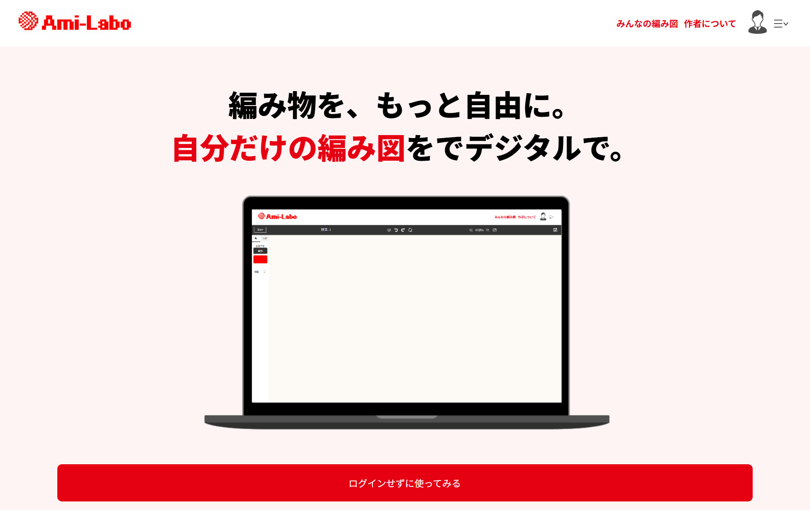
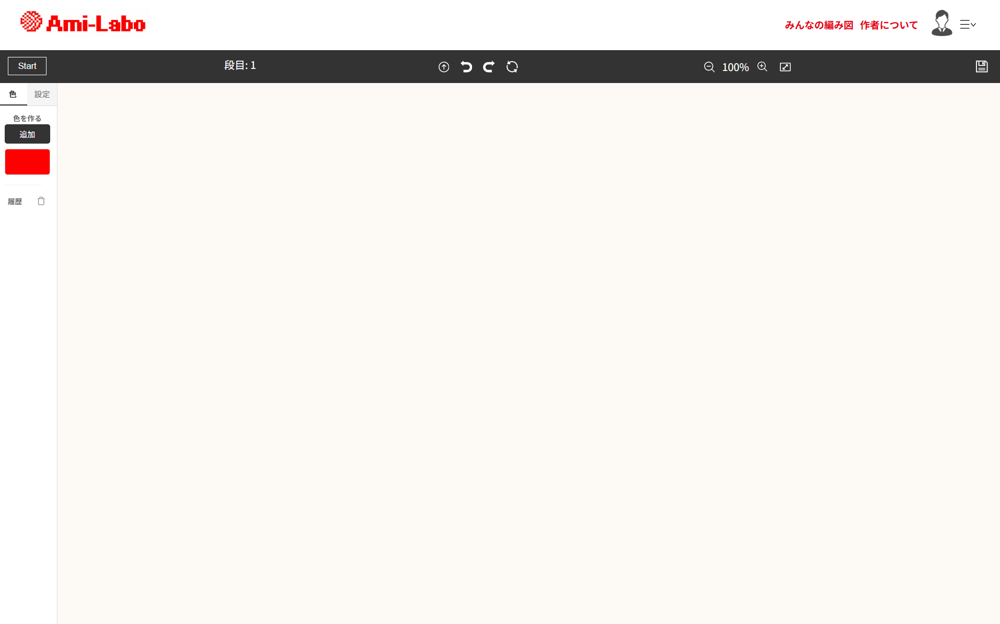
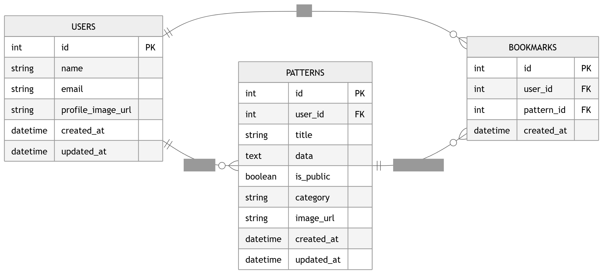

# Ami-Labo（アミラボ）

## 1. アプリの概要
初心者でも簡単にオリジナルの編み込み模様が作れる、編み物専用のドット絵作成アプリです。
画像の自動変換機能や、実際の編み目に合わせた比率調整機能を備え、アイデアを形にします。

## 2. アプリのスクショ

## 3. 使い方
1. 図案を作る: 好きな画像を読み込んで自動でドット絵に変換するか、ゼロからキャンバスにポチポチと描画します。
2. 比率を合わせる: 使う毛糸や編み方に合わせて、マス目の比率（ゲージ）を縦長・横長に調整し、完成イメージを確認します。
3. 編集する: ズーム機能や、自動で次のマスへ進む入力サポートを使って、サクサクと図案を仕上げます。
4. 共有・保存する: 完成した図案にタイトルやメモをつけて公開し、他のユーザーと編み図をシェアしたり、お気に入りを保存（ブックマーク）して管理します。

## 4. なぜこれを作ったか
私自身が編み物が好きで、「オリジナルの編み込み模様を作ってみたい！」と思ったのが開発のきっかけです。

しかし、初心者にとってゼロから図案を考えるのはハードルが高く、ペンでマス目を塗りつぶしては修正する作業は非常に手間でした。

「もっと手軽に、実際の編み上がりに近いイメージでデザインできる専用ツールが欲しい！」と考え、この『Ami-Labo』を開発しました。

## 5. 工夫したところ
編み物をする人の目線に立ち、使いやすさと課題解決にこだわりました。

### リアルな編み目比率（ゲージ）の再現
  マス目の縦横比を自由に変更できるようにし、編み上がり時の「思っていた形と違う」という悲しい失敗を防ぎます。
### ストレスフリーなUI/UX
  大きくズームしても操作パネルやカラーパレットが画面に固定されるレイアウトを採用。また、色を置くと自動で次のマスへ進む入力サポート機能を実装し、作業への没入感を高めました。
### データの安全な取得と表示制御（バックエンド）
  「公開・非公開」のステータス管理を徹底しました。ブックマーク一覧や検索機能（Ransack）を実装する際、必ず「公開済みのデータ（published）」をベースにしてからクエリを組み立てるように設計し、非公開データが他人に漏れないよう堅牢に実装しています。

## 6. 主な使用技術
### フロントエンド
HTML / CSS / JavaScript
Hotwire（Turbo）

### バックエンド
Ruby 3.1.6
Ruby on Rails 7.2.2
PostgreSQL（データベース）

### インフラ・開発環境
Heroku（デプロイ）
Git / GitHub（バージョン管理）

## 7. ER図

> ### 主なテーブル構成
> * Users: ユーザー情報
> * Patterns: 作成された編み図のデータ（タイトル、公開設定、画像など）
> * Bookmarks: ユーザーとパターンの保存関係を管理する中間テーブル
> * Posts: ユーザー情報
